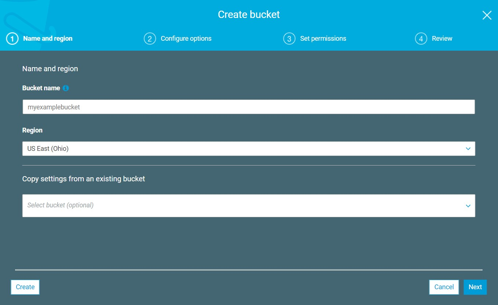
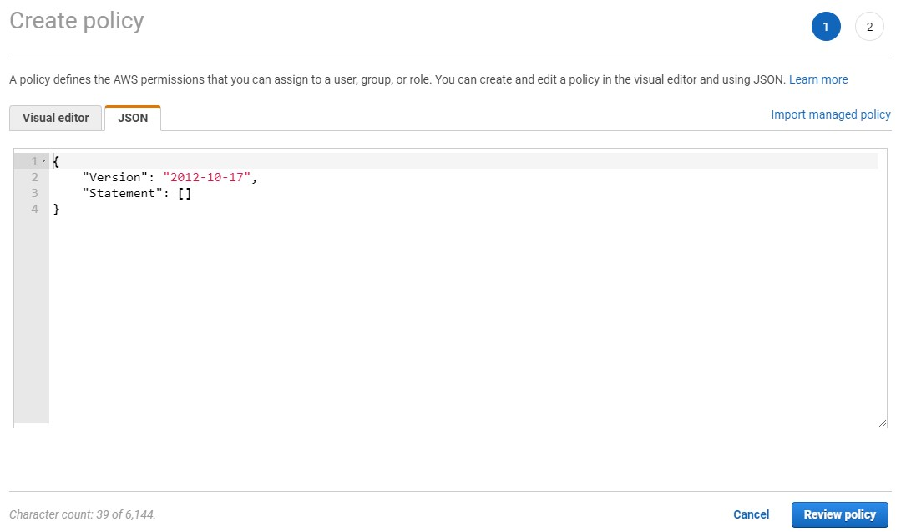
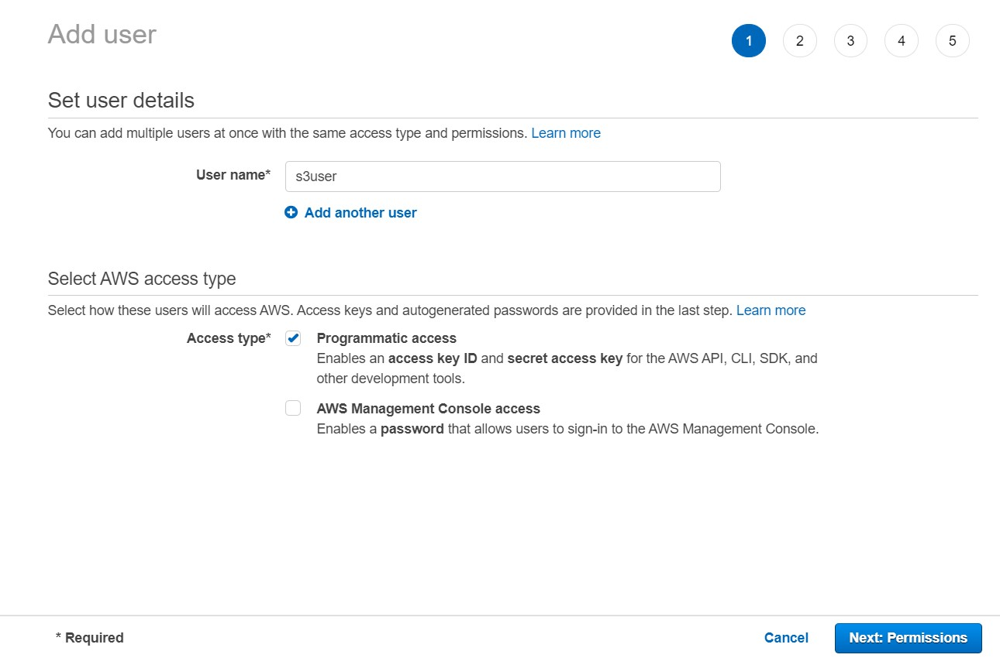
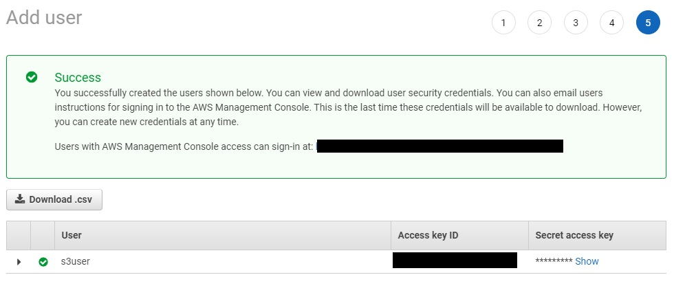

```{r, include = FALSE}
knitr::opts_chunk$set(
  collapse = TRUE,
  comment = "#>"
)
```
While AWS S3 storage can be public, storage buckets are private by default. The best practice is to set up security policies and credentials to control access to storage buckets. This appendix walks through S3 storage setup and credential creation. It assumes you have an AWs account but nothing more.

## Creating a Bucket
1. In the AWS management console, navigate to the **S3 console** and click the **Create Bucket** button. 
2. The key part of the Create Bucket wizard is the first screen, where you give the bucket a unique name. The closest region should be selected by default, but you can select a different one if needed.
  

3. Step through the rest of the wizard. You can accept the defaults -- they can be changed later if needed.

## Creating Access Keys
Once the S3 bucket exists, the next steps are setting up an Identity and Access Management (IAM) policy, creating a user, and generating credentials to access the storage.

1. In the **IAM console**, navigate to **Policies**. AWS provides some pre-configured policies that provide access to all S3 buckets in the account. These include the DataScientist, AmazonS3ReadOnlyAccess, and AmazonS3FullAccess policies. If you choose to use one of these predefined policies, proceed to Step 5. However, if you want to limit access to a specific bucket, it's best to create a custom policy.  
  
  
2. In the **JSON tab**, copy and paste the below policy, editing the bucket name as needed. This policy will allow a credential-holder to see the names of all the buckets owned by the AWS account and will grant full access to the specified bucket.  
  

```json
{
    "Version": "2012-10-17",
    "Statement": [
        {
            "Effect": "Allow",
            "Action": [
                "s3:ListAllMyBuckets"
            ],
            "Resource": [
                "arn:aws:s3:::*"
            ]
        },
        {
            "Effect": "Allow",
            "Action": [
                "s3:*"
            ],
            "Resource": [
                "arn:aws:s3:::myexamplebucket",
                "arn:aws:s3:::myexamplebucket/*"
            ]
        }
    ]
}
```

3. (Optional) If you switch to the **Visual editor** tab, you will see warnings as full access permissions include some resources that haven't been set up, but they can be ignored. You can also expand the actions menu here and fine-tune permissions.

4. On the **Review policy** screen, give the policy a name. The summary might show a notice that the policy defines some actions, resources, or conditions that do not provide permissions. You can ignore this notice and click **Create policy**.

5. Head to the **Users** section of the IAM console and **Add user**. Give the user a name. For AWS access type, select **Programmatic access**.  
  
  
6. In the **Set permissions** screen, choose **Add user to group**, then **Create group**.  
  

7. In the Create group dialogue box, give the group a name, then search for and attach the chosen policy and create the group.  
 

8. Click through the Tags screen, review and **Create user**.  

9. The next screen will provide the access key and secret key.  
  
  
10. The secret key won't be shown again, but if you need you can generate a new key at any time via the **Users** section. Click on the user name, then the **Security credentials** tab to create a new access key or deactivate an old one.  
  
